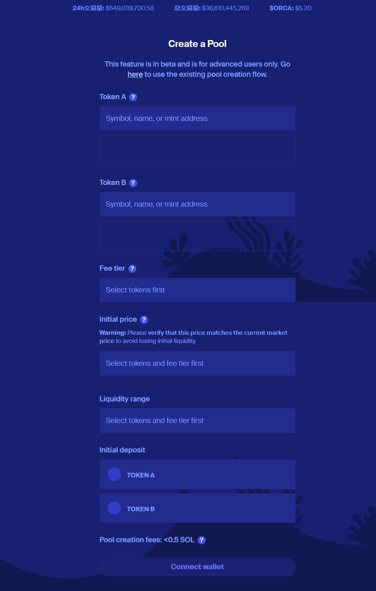
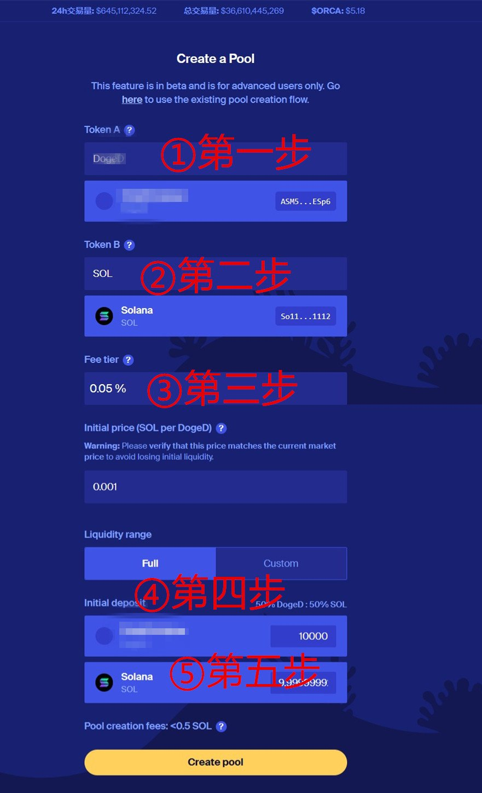
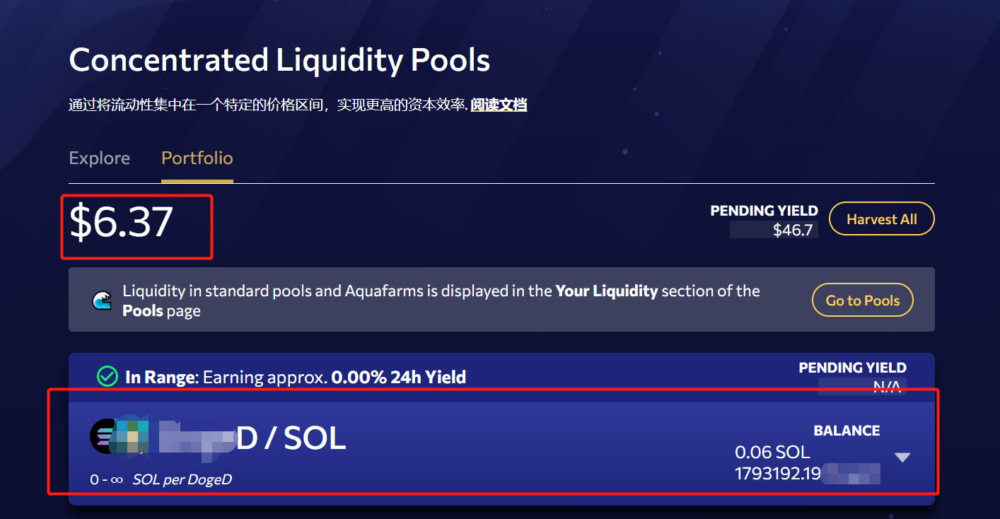
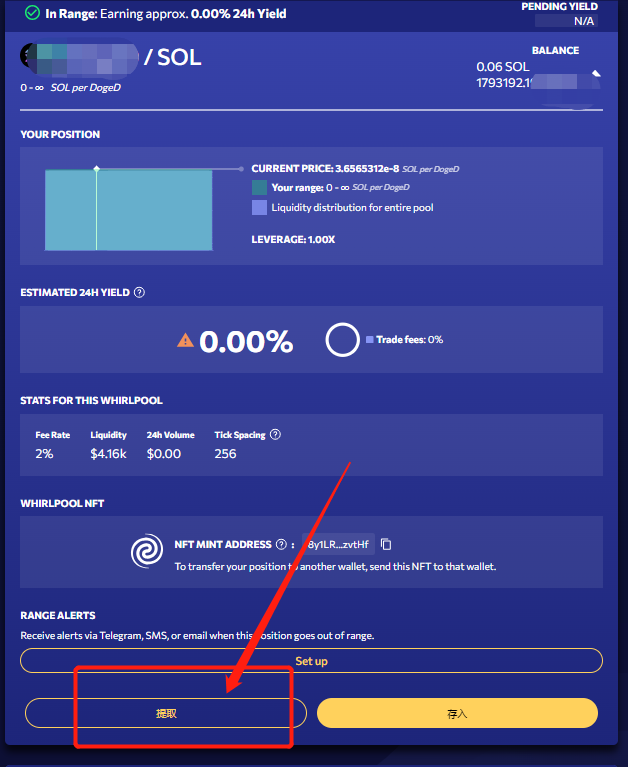
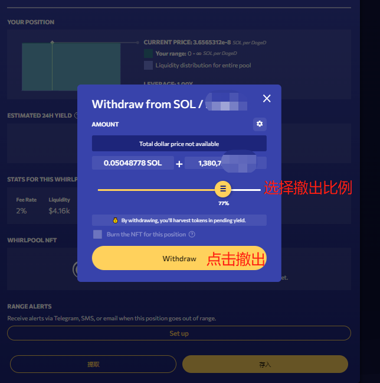

# Orca创建流动性教程

Orca是Sol链上较为知名的去中心化交易所之一，和Raydium相比，在Orca上创建流动性所需要的费用极低（通常少于0.5sol），而且大家习惯在Orca上创建USDC的池子，因为USDC池子比SOL池子的无偿损失会更低，不用担心Sol价格波动带来的风险。

下面教大家通过Orca创建流动性资金池：

打开网页：[https://www.orca.so/create-pool](https://www.orca.so/create-pool)，填写相应的代币信息：

- **Token A：**就是你发行的代币，输入合约地址找到你的币

- **Token B：**底池代币，例如USDT、SOL、USDC等

- **Fee tier：**就是费率/滑点，我的建议是填0.2%，填对的太小不利于交易

- **Initial price：**初始价格，假设你是做代币+sol的池子，那么这个价格就是一个币值多少sol的意思

- **Liquidity range：**流动性范围，指的是你代币价格的范围，目前有FULL和CUSTOM两个选择。如果你不懂什么意思，直接选择FULL这个就行，即：全范围，和薄饼V2是一样的。如果选择CUSTOM，就是V3的概念了，这里不建议使用。

所有的信息填写完成之后，下一步就是输入相应的代币数量。最终填写完成的如下：

确定价格无误之后，点击“Create Pool（创建池子）”，然后会跳出钱包，点击确认，即可完成资金池的创建。

**池子做好之后，应该如何查看？**

我们打开页面：[https://v1.orca.so/liquidity](https://v1.orca.so/liquidity) ，重新连接钱包（如果已经连接，则不需要）

然后点击Portfolio，等待几秒钟，就能看到自己的池子

如果你想撤池子，可以点击你的交易对，选择 **提取** 流动性（如果想继续加池子，就选择 **存入**）

之后，按照页面需要，选择撤出的流动性比例，再点击 **Withdraw，** 钱包确认并支付gas即可

以上就是关于ORCA加池/撤池的相关教程了，有任何问题，记得进入官方电报群联系管理员解答